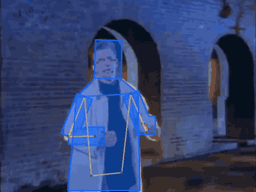
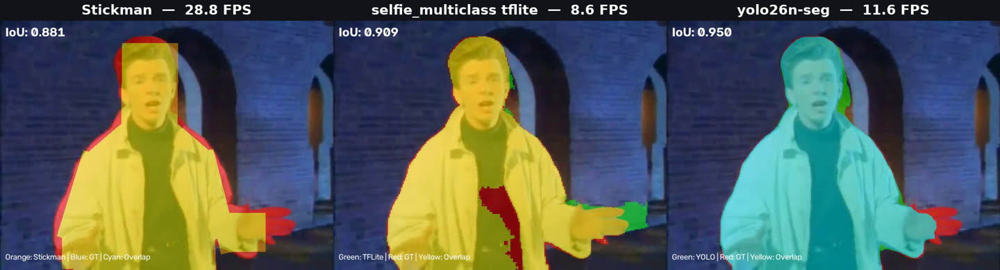
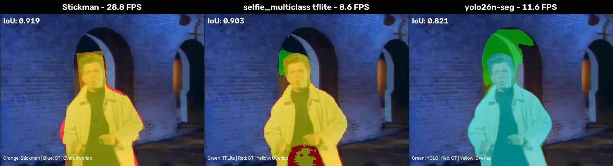
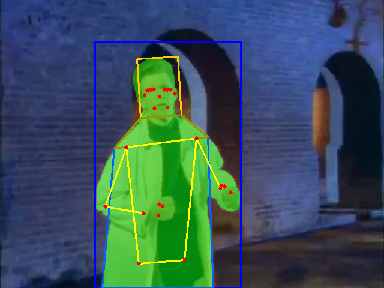

# Limiting Stickman Model

**Сегментация человека в реальном времени через геометрию, а не через тяжёлую нейросеть.**

Вместо того чтобы каждый кадр считать попиксельную маску, модель один раз калибруется
под конкретного человека, а дальше собирается из простых фигур (голова, шея, торс,
конечности, ладони) по 33 точкам скелета MediaPipe Pose. Точность почти та же,
скорость — в 2.5–3.3 раза выше.

<p align="center">
  
</p>

<p align="center">
  
  
  
</p>

---

## Зачем это нужно

Сегодня все нейросети, рисующие маску человека в реальном времени, упираются
в один и тот же компромисс: либо высокие требования к железу (SAM 3.1), либо
сравнительно низкая точность. На реальном видео средний IoU у быстрых моделей
не дотягивает и до 0.9 — а платить за это приходится десятками миллисекунд на кадр.

Идея проекта — сместить баланс: не улучшать саму сегментацию, а заменить её
геометрической моделью, один раз подогнанной под фигуру человека.

## Результаты

Все замеры — на одном и том же видео [`example/example.mp4`](example/example.mp4),
CPU, per-frame.

| Подход | Средний IoU | Скорость | Видео |
|---|---:|---:|---|
| `selfie_multiclass_256x256.tflite` | 0.8953 | 8.6 FPS | [output_tflite_vs_gt.mp4](example/output_tflite_vs_gt.mp4) |
| `yolo26n-seg.pt` | 0.8854 | 11.6 FPS | [output_yolo_vs_gt.mp4](example/output_yolo_vs_gt.mp4) |
| **Stickman-модель** | **0.8750** | **28.8 FPS** | [output_stickman_accuracy.mp4](example/output_stickman_accuracy.mp4) |



<sub>Один и тот же кадр, три подхода. Подписанный на кадре IoU — покадровый,
в таблице выше — средний по всему ролику.</sub>

Читать так: stickman-модель на **простых** для сегментации кадрах **теряет 2 пункта IoU** относительно лучшего
из сравниваемых подходов, но идёт **в 3.3 раза быстрее**. Форма ошибки тоже
другая — модель не «шумит» по контуру, а систематически срезает углы там,
где реальный силуэт сложнее прямоугольника (кисти, полы одежды).
В результате чего на **сложных** для сегментации кадрах stickman-модель **прибавляет 2 пункта IoU**

## Как это работает

Пайплайн распадается на два этапа: **калибровка** (один раз, медленно и точно)
и **отслеживание** (каждый кадр, быстро).

### 1. Калибровка — `calibrate_stickman.py`

Берётся один кадр видео и по нему подгоняются пропорции модели:

1. **YOLO26s** находит человека и вырезает кроп с запасом 10 %.
2. **InSPyReNet** (`transparent-background`) строит по кадру эталонную маску.
3. **`pose_landmarker_full`** даёт точный скелет, **`face_landmarker`** — подбородок (точка 152).
4. **Голова**: прямоугольник с центром в носу; ширина — продление отрезка ушей
   до границы маски, вверх — до макушки, вниз — до подбородка.
5. **Торс**: четырёхугольник, у которого верхние вершины — плечи, вытянутые
   наружу до границы маски, а нижняя граница ищется вычитанием модели ног —
   так ловится свисающая одежда.

Все размеры нормируются на ширину плеч `S = |11 − 12|` и сохраняются в JSON
как безразмерные коэффициенты. Именно поэтому модель переживает изменение
масштаба: человек подошёл ближе — коэффициенты те же, `S` другое.



<sub>Зелёное — эталонная маска InSPyReNet, синее — bbox YOLO, оранжевое и жёлтое —
подогнанные под маску прямоугольник головы, шея и четырёхугольник торса.</sub>

### 2. Отслеживание — `track_stickman.py`

На каждом кадре нужен только **`pose_landmarker_lite`**. По текущим точкам
скелета и сохранённым коэффициентам заново собираются голова, шея, торс,
восемь прямоугольников конечностей и два квадрата ладоней. Никакой попиксельной
сегментации в этом контуре нет — отсюда и скорость.

```
калибровка (1 кадр)                    отслеживание (каждый кадр)
──────────────────────                 ──────────────────────────
YOLO26s      → кроп                    pose_landmarker_lite → 33 точки
InSPyReNet   → эталонная маска                    ↓
pose_full    → скелет                  коэффициенты × S(кадра)
face         → подбородок                         ↓
      ↓                                голова + шея + торс +
calibration_params.json  ──────────→   конечности + ладони
```

## Установка

Нужен Python 3.9+. Веса моделей в репозитории не лежат — они скачиваются
автоматически при первом запуске (см. [Модели](#модели)).

```bash
git clone https://github.com/nkarbofos/LimitingStickmanModel.git
cd LimitingStickmanModel

python -m venv .venv
source .venv/bin/activate        # Windows: .venv\Scripts\activate

pip install -e .                 # отслеживание
pip install -e ".[calib]"        # + калибровка (тянет torch, ~2 ГБ)
```

Зависимости разделены намеренно: отслеживанию нужен только MediaPipe и OpenCV,
а YOLO и InSPyReNet участвуют исключительно в калибровке. Готовая калибровка
для демо-видео уже лежит в [`example/calibration_params.json`](example/calibration_params.json),
поэтому базовой установки достаточно, чтобы сразу увидеть результат.

## Быстрый старт

```bash
# наложить модель на демо-видео -> output/example_tracked.mp4
python track_stickman.py

# то же самое, но без сегментатора: он не участвует в построении модели
# и съедает большую часть времени кадра
python track_stickman.py --no-segmentation

# откалиброваться заново (нужен экстра [calib])
python calibrate_stickman.py

# свои данные
python calibrate_stickman.py --video my.mp4 --frame 5
python track_stickman.py     --video my.mp4 --output out.mp4
```

> **Про скорость.** По умолчанию `track_stickman.py` работает в режиме бенчмарка
> и параллельно гоняет `selfie_multiclass`, чтобы было с чем сравнивать. Сама
> stickman-модель его результат не использует (он виден только при
> `config.SHOW_CURR_MASK = True`). Заявленные в таблице **28.8 FPS** — это режим
> `--no-segmentation`; с включённым сегментатором цифра будет в разы ниже,
> и это ожидаемо.

Результаты пишутся в `output/`:

| Файл | Чем создаётся |
|---|---|
| `output/example_tracked.mp4` | `track_stickman.py` |
| `output/calibration_params.json` | `calibrate_stickman.py` |
| `output/calibration_result.png` | `calibrate_stickman.py` |

`track_stickman.py` берёт калибровку из `output/calibration_params.json`,
а если её ещё нет — из `example/calibration_params.json`.

Полный список опций — `python track_stickman.py --help` и
`python calibrate_stickman.py --help`.

После `pip install` те же команды доступны как `stickman-track`,
`stickman-calibrate` и `stickman-download-models`.

## Модели

Веса не хранятся в git: они скачиваются в `models/` при первом обращении.
Каталог можно переопределить переменной окружения `STICKMAN_MODELS_DIR`.

| Модель | Размер | Где используется |
|---|---:|---|
| `pose_landmarker_lite.task` | 5.8 МБ | отслеживание — скелет каждый кадр |
| `selfie_multiclass_256x256.tflite` | 16.4 МБ | отслеживание — эталон для сравнения |
| `pose_landmarker_full.task` | 9.4 МБ | калибровка — точный скелет |
| `face_landmarker.task` | 3.8 МБ | калибровка — подбородок |
| `yolo26s.pt` | 20.4 МБ | калибровка — детекция человека |
| `yolo26n.pt` | 5.5 МБ | опционально — кроп при отслеживании (`--yolo-crop`) |
| `yolo26n-seg.pt` | 6.7 МБ | опционально — сравнение качества |

InSPyReNet скачивает свои веса сам, при первом вызове `transparent-background`.

Скачать всё заранее (например, перед работой в офлайне):

```bash
stickman-download-models --list          # что есть и чего не хватает
stickman-download-models                 # всё
stickman-download-models --group track   # только для отслеживания
python -m bench.download --group calibrate
```

Флаг `--no-download` у обоих скриптов отключает автозагрузку — тогда
недостающая модель приводит к понятной ошибке вместо похода в сеть.

## Структура репозитория

```
LimitingStickmanModel/
├── calibrate_stickman.py   # точка входа: калибровка
├── track_stickman.py       # точка входа: отслеживание
├── pyproject.toml
├── bench/
│   ├── paths.py            # пути проекта (models/, example/, output/)
│   ├── download.py         # автозагрузка весов
│   ├── config.py           # все настройки и коэффициенты
│   ├── cli.py              # аргументы командной строки
│   ├── models.py           # создание детекторов MediaPipe и YOLO
│   ├── calibrate.py        # сценарий калибровки
│   ├── calibration.py      # геометрия подгонки головы и торса по маске
│   ├── tracking.py         # сборка фигур по коэффициентам калибровки
│   ├── stickman_model.py   # примитивы модели тела
│   ├── main.py             # цикл отслеживания и замер скорости
│   ├── visualization.py    # отрисовка масок, скелета, овала лица
│   ├── head_constraint.py  # ограничение головы эллипсом
│   ├── yolo_crop.py        # bbox человека и вычисление кропа
│   └── stats.py            # статистика задержек
├── example/                # демо-видео, калибровка и записи сравнений
├── models/                 # веса (создаётся автоматически, вне git)
└── output/                 # результаты (создаётся автоматически, вне git)
```

## Настройка

Всё, что не вынесено в аргументы, живёт в [`bench/config.py`](bench/config.py).
Самое полезное:

| Параметр | Что делает |
|---|---|
| `SHOW_CURR_MASK` | показывать маску сегментатора поверх кадра |
| `SHOW_CONFIDENCE_HEATMAP` | тепловая карта уверенности вместо цветов категорий |
| `DRAW_STICKMAN` | рисовать полную модель тела (торс + конечности + ладони) |
| `STICKMAN_LIMB_COEFS` | ширина каждой конечности в долях от ширины плеч |
| `STICKMAN_PALM_COEF` | сторона квадрата ладони |
| `CALIBRATION_W_EXTRA_THRESHOLD` | порог поиска нижней границы свисающей одежды |
| `CALIBRATION_EAR_EXTEND_COEF` | максимальное продление головы от ушей |
| `ENABLE_HEAD_CONSTRAINT` | обрезать маску верхним полуэллипсом головы |

## Ограничения

- Калибровка привязана к конкретному человеку и его одежде: сменился кадр —
  нужна новая калибровка.
- Модель считает тело набором выпуклых фигур, поэтому систематически теряет
  кисти рук и сложные полы одежды — это видно на сравнительных видео.
- Один человек в кадре: и калибровка, и отслеживание берут самый большой bbox.
- Скрипт, которым считался IoU и рендерились сравнительные ролики
  `output_*_vs_gt.mp4`, в репозиторий пока не входит — цифры из таблицы
  воспроизвести «из коробки» нельзя.
- Лицензия не выбрана: пока её нет, права по умолчанию остаются за автором.

## Благодарности

Проект стоит на [MediaPipe Tasks](https://ai.google.dev/edge/mediapipe/solutions/guide)
(Pose Landmarker, Image Segmenter, Face Landmarker),
[Ultralytics YOLO](https://github.com/ultralytics/ultralytics) и
[InSPyReNet](https://github.com/plemeri/transparent-background).
